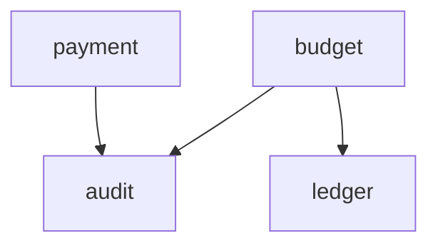
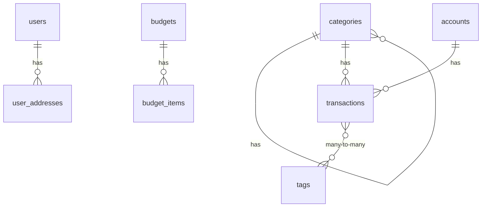

<!-- AUTO-GENERATED by scripts/generate-architecture-graph.sh -->
<!-- Do not edit manually. Regenerate with: ./scripts/generate-architecture-graph.sh -->
<!-- Generated: 2026-03-20T13:17:49Z -->

# Orbit Architecture Graph

## 1. Module Overview & Layer Completeness

| Module | api | core | infrastructure | exception |
|--------|-----|------|----------------|-----------|
| audit | ✓ | ✓ | ✓ | — |
| budget | ✓ | ✓ | ✓ | — |
| common | ✓ | ✓ | ✓ | ✓ |
| config | — | — | — | — |
| crypto | — | — | ✓ | — |
| integration | — | ✓ | ✓ | — |
| ledger | ✓ | ✓ | ✓ | — |
| payment | ✓ | ✓ | ✓ | — |
| security | ✓ | ✓ | ✓ | — |

## 2. Module Dependency Graph

## 3. Cross-cutting Dependencies

| Module | common | config | security |
|--------|--------|--------|----------|
| audit | ✓ (14) | — | — |
| budget | ✓ (38) | — | — |
| crypto | ✓ (2) | — | — |
| integration | ✓ (2) | — | — |
| ledger | ✓ (55) | — | — |
| payment | ✓ (32) | — | — |

## 4. Key Classes Per Module

### audit

**Controllers:** NotificationController
**Services:** NotificationService
**Entities:** AuditLogEntity, NotificationEntity
**Repositories:** AuditLogRepository, NotificationRepository

### budget

**Controllers:** BudgetController, GoalController
**Services:** ContributeGoalService, CreateBudgetService, CreateGoalService, GetBudgetService, GetGoalService, UpdateGoalService
**Entities:** BudgetEntity, BudgetItemEntity, GoalEntity
**Repositories:** BudgetItemRepository, BudgetRepository, GoalRepository

### common

**Controllers:** GlobalExceptionHandler
**Entities:** BaseEntity, CreatedOnlyEntity

### config

### crypto

**Entities:** CryptoAssetEntity, CryptoPortfolioSnapshotEntity
**Repositories:** CryptoAssetRepository, CryptoPortfolioSnapshotRepository

### integration

**Entities:** ExchangeRateEntity, PlaidLinkEntity
**Repositories:** ExchangeRateRepository, PlaidLinkRepository

### ledger

**Controllers:** AccountController, CategoryController, RecurringTransactionController, TransactionController
**Services:** CreateAccountService, CreateCategoryService, CreateTransactionService, GetAccountService, GetCategoryService, GetTransactionService, RecurringTransactionService, UpdateAccountService, UpdateCategoryService, UpdateTransactionService
**Entities:** AccountEntity, CategoryEntity, RecurringTransactionEntity, TagEntity, TransactionEntity
**Repositories:** AccountRepository, CategoryRepository, RecurringTransactionRepository, TagRepository, TransactionRepository

### payment

**Controllers:** PaymentMethodController, SubscriptionController
**Services:** PaymentMethodService, SubscriptionService
**Entities:** PaymentMethodEntity, SubscriptionEntity
**Repositories:** PaymentMethodRepository, SubscriptionRepository

### security

**Controllers:** UserController
**Services:** CreateUserService, GetUserService, UpdateUserService
**Entities:** NotificationPreferenceEntity, UserAddressEntity, UserEntity, UserPreferenceEntity
**Repositories:** NotificationPreferenceRepository, UserAddressRepository, UserPreferenceRepository, UserRepository

## 5. Database Entity Relationships

## 6. API Endpoint Inventory

### ledger — RecurringTransactionController

| Method | Path | Description |
|--------|------|-------------|
| POST | `/api/v1/recurring-transactions` | Create recurring transaction rule |
| GET | `/api/v1/recurring-transactions/{id}` | Get recurring transaction by ID |
| GET | `/api/v1/recurring-transactions/user/{userId}` | Get recurring transactions for a user |
| PATCH | `/api/v1/recurring-transactions/{id}` | Update recurring transaction |
| PATCH | `/api/v1/recurring-transactions/{id}/pause` | Toggle pause/resume |
| DELETE | `/api/v1/recurring-transactions/{id}` | Cancel recurring transaction |

### ledger — CategoryController

| Method | Path | Description |
|--------|------|-------------|
| POST | `/api/v1/categories` | Create a category |
| GET | `/api/v1/categories/system` | Get system categories |
| GET | `/api/v1/categories/user/{userId}` | Get user categories |
| PATCH | `/api/v1/categories/{categoryId}` | Update a category |
| DELETE | `/api/v1/categories/{categoryId}` | Delete a category |

### ledger — AccountController

| Method | Path | Description |
|--------|------|-------------|
| POST | `/api/v1/accounts` | Create a new account |
| GET | `/api/v1/accounts/{accountId}` | Get account by ID |
| GET | `/api/v1/accounts/user/{userId}` | Get all accounts for a user |
| PATCH | `/api/v1/accounts/{accountId}` | Update an account |
| DELETE | `/api/v1/accounts/{accountId}` | Delete an account |

### ledger — TransactionController

| Method | Path | Description |
|--------|------|-------------|
| POST | `/api/v1/transactions` | Create a transaction |
| GET | `/api/v1/transactions/{transactionId}` | Get transaction by ID |
| GET | `/api/v1/transactions/account/{accountId}` | Get transactions for an account |
| PATCH | `/api/v1/transactions/{transactionId}` | Update a transaction |
| DELETE | `/api/v1/transactions/{transactionId}` | Void a transaction |

### security — UserController

| Method | Path | Description |
|--------|------|-------------|
| POST | `/api/v1/users` | Register a new user |
| GET | `/api/v1/users/clerk/{clerkUserId}` | Get user by Clerk ID |
| PATCH | `/api/v1/users/{userId}` | Update user profile |
| DELETE | `/api/v1/users/{userId}` | Deactivate a user |

### payment — SubscriptionController

| Method | Path | Description |
|--------|------|-------------|
| POST | `/api/v1/subscriptions` | Create a subscription |
| GET | `/api/v1/subscriptions/{id}` | Get subscription by ID |
| GET | `/api/v1/subscriptions/user/{userId}` | Get subscriptions for a user |
| PATCH | `/api/v1/subscriptions/{id}` | Update a subscription |
| DELETE | `/api/v1/subscriptions/{id}` | Cancel a subscription |
| PATCH | `/api/v1/subscriptions/{id}/pause` | Toggle subscription pause |

### payment — PaymentMethodController

| Method | Path | Description |
|--------|------|-------------|
| POST | `/api/v1/payment-methods` | Create a payment method |
| GET | `/api/v1/payment-methods/{id}` | Get payment method by ID |
| GET | `/api/v1/payment-methods/user/{userId}` | Get payment methods for a user |
| PATCH | `/api/v1/payment-methods/{id}` | Update a payment method |
| DELETE | `/api/v1/payment-methods/{id}` | Delete a payment method |

### common — GlobalExceptionHandler

| Method | Path | Description |
|--------|------|-------------|

### audit — NotificationController

| Method | Path | Description |
|--------|------|-------------|
| GET | `/api/v1/notifications/user/{userId}` | Get notifications for a user |
| GET | `/api/v1/notifications/user/{userId}/unread-count` | Get unread notification count |
| PUT | `/api/v1/notifications/{id}/read` | Mark notification as read |
| PUT | `/api/v1/notifications/user/{userId}/read-all` | Mark all notifications as read |

### budget — GoalController

| Method | Path | Description |
|--------|------|-------------|
| POST | `/api/v1/goals` | Create a new goal |
| GET | `/api/v1/goals/{goalId}` | Get goal by ID |
| GET | `/api/v1/goals/user/{userId}` | Get goals for a user |
| PATCH | `/api/v1/goals/{goalId}/contribute` | Contribute to a goal |
| PATCH | `/api/v1/goals/{goalId}` | Update a goal |
| DELETE | `/api/v1/goals/{goalId}` | Cancel a goal |

### budget — BudgetController

| Method | Path | Description |
|--------|------|-------------|
| POST | `/api/v1/budgets` | Create a new budget |
| GET | `/api/v1/budgets/{budgetId}` | Get budget by ID |
| GET | `/api/v1/budgets/user/{userId}` | Get budgets for a user |
| PATCH | `/api/v1/budgets/{budgetId}/archive` | Archive a budget |
| PATCH | `/api/v1/budgets/{budgetId}` | Update a budget |
| DELETE | `/api/v1/budgets/{budgetId}` | Delete a budget |

