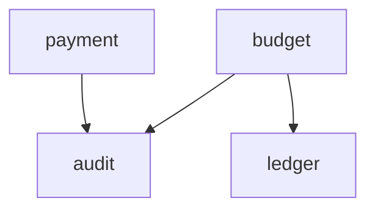
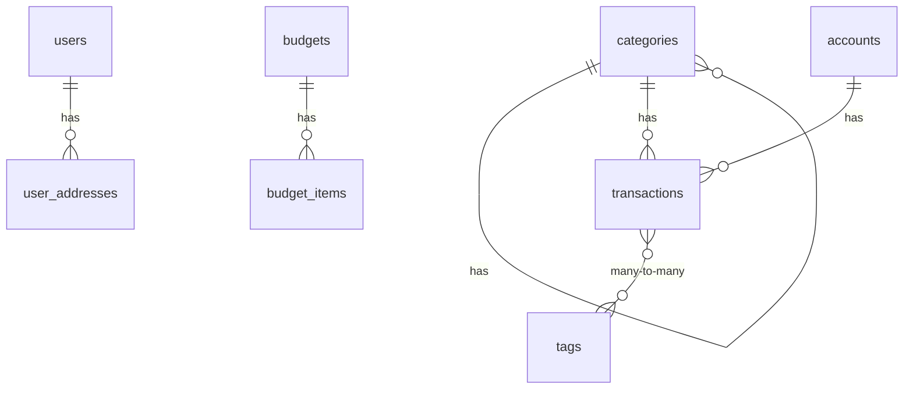

<!-- AUTO-GENERATED by scripts/generate-architecture-graph.sh -->
<!-- Do not edit manually. Regenerate with: ./scripts/generate-architecture-graph.sh -->
<!-- Generated: 2026-03-20T13:15:45Z -->

# Orbit Architecture Graph

## 1. Module Overview & Layer Completeness

| Module | api | core | infrastructure | exception |
|--------|-----|------|----------------|-----------|
| audit | ✓ | ✓ | ✓ | — |
| budget | ✓ | ✓ | ✓ | — |
| common | ✓ | ✓ | ✓ | ✓ |
| config | — | — | — | — |
| crypto | — | — | ✓ | — |
| integration | — | ✓ | ✓ | — |
| ledger | ✓ | ✓ | ✓ | — |
| payment | ✓ | ✓ | ✓ | — |
| security | ✓ | ✓ | ✓ | — |

## 2. Module Dependency Graph

## 3. Cross-cutting Dependencies

| Module | common | config | security |
|--------|--------|--------|----------|
| audit | ✓ (14) | — | — |
| budget | ✓ (38) | — | — |
| crypto | ✓ (2) | — | — |
| integration | ✓ (2) | — | — |
| ledger | ✓ (55) | — | — |
| payment | ✓ (32) | — | — |

## 4. Key Classes Per Module

### audit

**Controllers:** NotificationController
**Services:** NotificationService
**Entities:** AuditLogEntity, NotificationEntity
**Repositories:** AuditLogRepository, NotificationRepository

### budget

**Controllers:** BudgetController, GoalController
**Services:** ContributeGoalService, CreateBudgetService, CreateGoalService, GetBudgetService, GetGoalService, UpdateGoalService
**Entities:** BudgetEntity, BudgetItemEntity, GoalEntity
**Repositories:** BudgetItemRepository, BudgetRepository, GoalRepository

### common

**Controllers:** GlobalExceptionHandler
**Entities:** BaseEntity, CreatedOnlyEntity

### config

### crypto

**Entities:** CryptoAssetEntity, CryptoPortfolioSnapshotEntity
**Repositories:** CryptoAssetRepository, CryptoPortfolioSnapshotRepository

### integration

**Entities:** ExchangeRateEntity, PlaidLinkEntity
**Repositories:** ExchangeRateRepository, PlaidLinkRepository

### ledger

**Controllers:** AccountController, CategoryController, RecurringTransactionController, TransactionController
**Services:** CreateAccountService, CreateCategoryService, CreateTransactionService, GetAccountService, GetCategoryService, GetTransactionService, RecurringTransactionService, UpdateAccountService, UpdateCategoryService, UpdateTransactionService
**Entities:** AccountEntity, CategoryEntity, RecurringTransactionEntity, TagEntity, TransactionEntity
**Repositories:** AccountRepository, CategoryRepository, RecurringTransactionRepository, TagRepository, TransactionRepository

### payment

**Controllers:** PaymentMethodController, SubscriptionController
**Services:** PaymentMethodService, SubscriptionService
**Entities:** PaymentMethodEntity, SubscriptionEntity
**Repositories:** PaymentMethodRepository, SubscriptionRepository

### security

**Controllers:** UserController
**Services:** CreateUserService, GetUserService, UpdateUserService
**Entities:** NotificationPreferenceEntity, UserAddressEntity, UserEntity, UserPreferenceEntity
**Repositories:** NotificationPreferenceRepository, UserAddressRepository, UserPreferenceRepository, UserRepository

## 5. Database Entity Relationships

